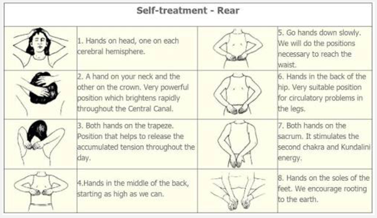
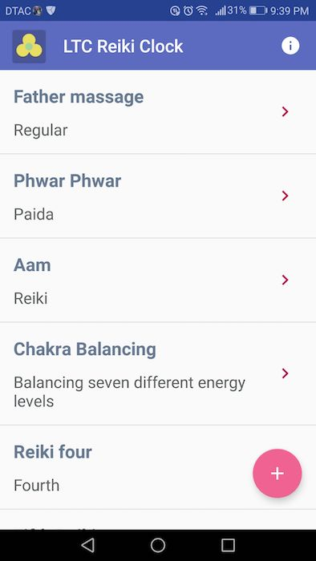
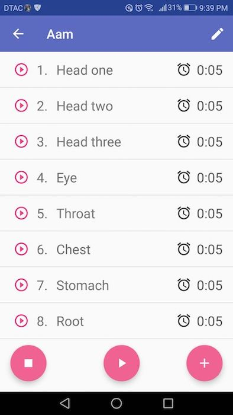
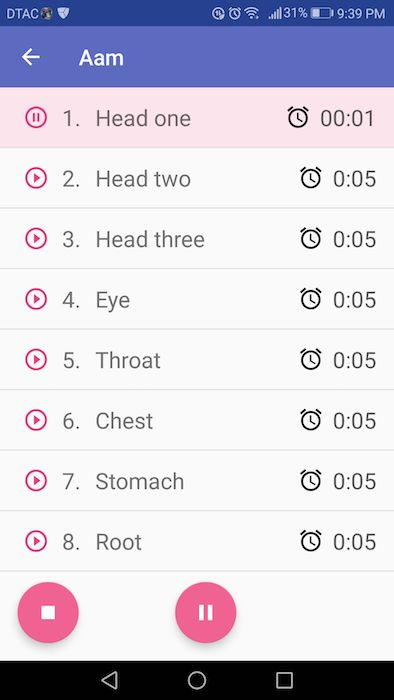
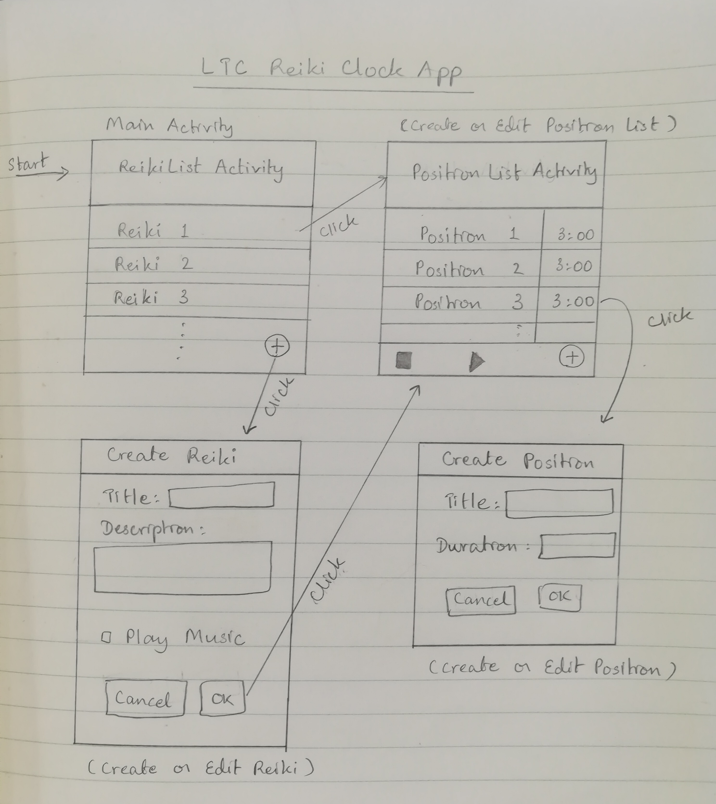
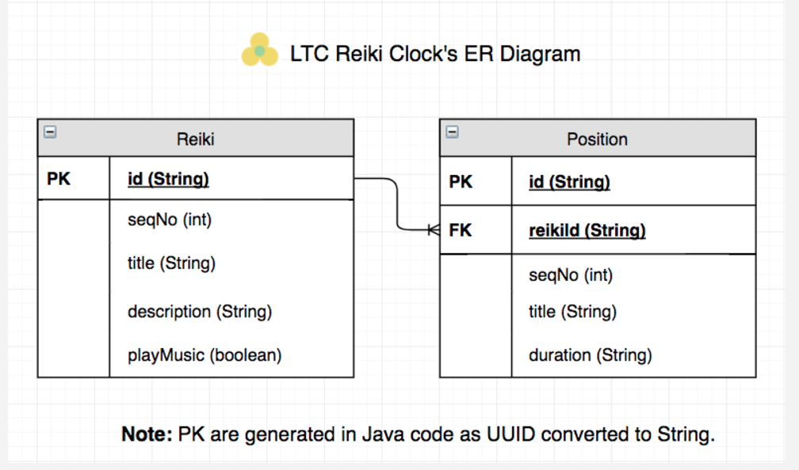

# LTC Reiki Clock

## Play Store Links
[Paid Version](https://play.google.com/store/apps/details?id=com.learnteachcenter.ltcreikiclock.paid)

[Free Version](https://play.google.com/store/apps/details?id=com.learnteachcenter.ltcreikiclock.free)

## Download APKs
[Download FREE version](https://s3.us-east-2.amazonaws.com/ltcclock/Public/reiki/LTC-Reiki-Clock-FREE.apk)

[Download Paid version](https://s3.us-east-2.amazonaws.com/ltcclock/Public/reiki/LTC-Reiki-Clock.apk)

Table of Contents

[What is Reiki?](https://github.com/noblesilence/LTC_Reiki_Clock_V2#what-is-reiki)

[How is Reiki Done?](https://github.com/noblesilence/LTC_Reiki_Clock_V2#how-is-reiki-done)

[What Does the App Do?](https://github.com/noblesilence/LTC_Reiki_Clock_V2#what-does-the-app-do)

[How to Use the App](https://github.com/noblesilence/LTC_Reiki_Clock_V2#how-to-use-the-app)

[App Screenshots](https://github.com/noblesilence/LTC_Reiki_Clock_V2#app-screenshots)

[App Design](https://github.com/noblesilence/LTC_Reiki_Clock_V2#app-design)

[Bugs](https://github.com/noblesilence/LTC_Reiki_Clock_V2#bugs)

## What is Reiki?
Reiki is a Japanese technique for stress reduction and relaxation that also promotes healing.

## How is Reiki Done?
The Reiki Practitioner gently rests his/her hands over a person's body in a series of hand positions that covers the receivers head, trunk, legs and feet. 
Energy flows through the practitioners hands to the client's body.

When a Reiki session begins, the practitioner lays hands on the first position **Head** for a certain amount of time, e.g. 3 minutes and then move to the next position **Abdomen** and stays there for the next 3 minutes and so on, until the last position **Feet**.

||
|:--:| 
|*Reiki: Hand Position at Eyes*|

||
|:--:| 
|*Reiki: Hand Position at Abdomen*|

||
|:--:| 
|*Self-Reiki*|

## What Does the App Do?
Reiki Clock helps the Reiki practitioner by reminding him/her with a sound when it is time to move to the next position.
The app plays a set of timers in sequence; each timer corresponds to each hand position.
Background music is also played if user chooses.

## How to Use the App
First, the practitioner (user) enters info about a **Reiki** item (title, description, whether or not to play music). 
Inside a Reiki item, the user enters a series of hand **Positions**, which has a title and a duration.
After all data are entered, the user is ready to start Reiki treatment.

When a Reiki session is about to start, the practitioner chooses a Reiki item, which will display a list of Positions.
The practitioner will then click **Play** button. 
The app will start the first timer, and the practitioner will start Reiki treatment.

## App Screenshots
||
|:--:| 
|*Reiki List*|

||
|:--:| 
|*Position List*|

||
|:--:| 
|*Reiki Started*|

## App Design
||
|:--:| 
|*Activities*|

||
|:--:| 
|*ER Diagram*|

## Bugs
Currently, the first time user plays a Reiki session, it is ok. 
But after finishing the first round (finished playing all timers) and start a new round (i.e. user clicks **Play** again), the app is jumping positions, and reminder sound may or may not play.
